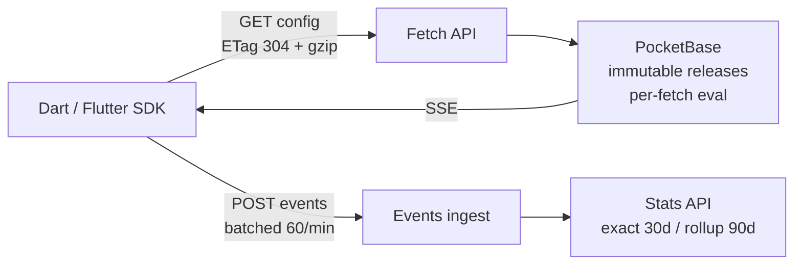

# ConfigWire — Real-Time Remote Configuration

Self-hosted feature flags and remote config in a single Go binary on PocketBase.


[](https://pub.dev/packages/configwire)


<p align="center">
  
</p>

## How it works



Fetch is stateless. Each request is evaluated against the current immutable release, then pushed live over SSE.

## Repositories

| Repo | What it is |
| ---- | ---------- |
| [configwire/configwire](https://github.com/configwire/configwire) | Go single-binary server. PocketBase v0.40.4, SQLite, static Admin UI, SSE, purge. k6 p95 0.78ms at 100rps. |
| [configwire/dart](https://github.com/configwire/dart) · [pub.dev](https://pub.dev/packages/configwire) | Pure-Dart client, Flutter-compatible. Bring-your-own `CacheStore`, SSE with 15-min poll fallback. |

## 60-second taste

Run the server:

```bash
docker run -d --name configwire \
  -p 8090:8090 -v cw-data:/app/pb_data \
  ghcr.io/configwire/configwire:latest
# open http://localhost:8090
```

Fetch config:

```bash
curl -H "X-ConfigWire-Key: <SDK_KEY>" \
  "http://localhost:8090/api/v1/env/dev/config?uid=u123&platform=ios&appVersion=1.2.0"
# {"version":1,"etag":"b41b62605c0df712","values":{"launch_flag":true},...}
# Unchanged? Send If-None-Match: <etag> → 304 empty.
```

Use it in Dart:

```dart
final cw = ConfigWire(
  apiKey: 'YOUR_SDK_KEY', env: 'dev',
  baseUrl: 'http://localhost:8090',
  defaults: {'launch_flag': false},
);
await cw.ensureInitialized();
await cw.fetchAndActivate();
final on = cw.getBool('launch_flag');
```

> Full end-to-end (publish, keys, events, stats) lives in the [server README](https://github.com/configwire/configwire#quickstart-end-to-end-curl).

## Why ConfigWire

- **One binary + SQLite.** No Redis or Kafka — just a volume at `/app/pb_data`.
- **Immutable releases.** Explicit `publish` / `rollback`, every fetch pins `version` + `etag`.
- **Per-fetch eval + targeting.** `uid`, `platform`, `appVersion`, `locale`, `country`, `attrs` (max 8192 bytes).
- **Private by default.** Events carry `userHash` only — no raw IDs, no PII in flag values.
- **Fast where it counts.** ETag `304`, gzip, p95 0.78ms at 100rps fetch + 50rps exposure (k6).

## Links

- [Wire contract](https://github.com/configwire/configwire/blob/main/docs/CONTRACT.md) · [Security](https://github.com/configwire/configwire/blob/main/docs/SECURITY.md) · [Key rotation](https://github.com/configwire/configwire/blob/main/docs/ROTATION.md)
- Docker: `ghcr.io/configwire/configwire:latest`

---

MIT © 2026 Lam Thanh Nhan
